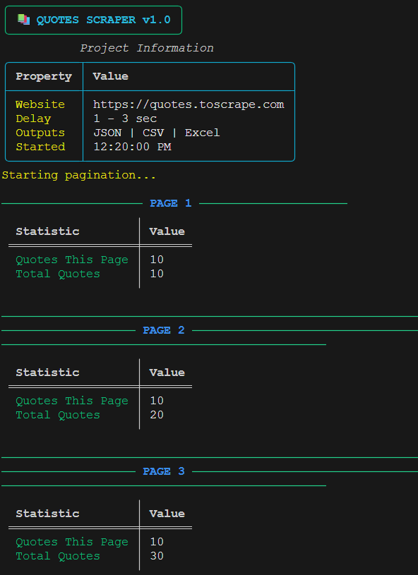
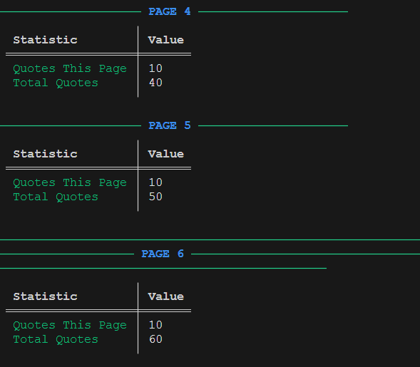
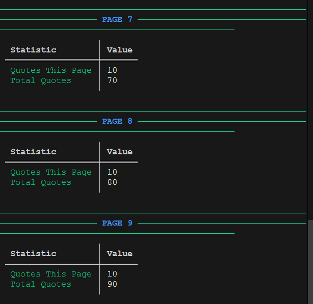
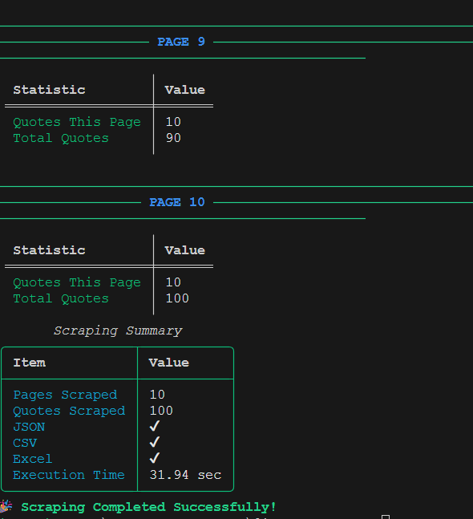

# 📚 Quotes Scraper

A professional Python web scraper that extracts quotes, authors, and tags from **Quotes to Scrape** using **Requests** and **BeautifulSoup**.

The scraper automatically handles pagination, exports data into multiple formats, logs the scraping process, and follows a clean modular architecture.

---
## 📸 Preview


<hr>

<hr>

<hr>

<hr>

## 🚀 Features

- ✅ Clean Modular Architecture
- ✅ Requests + BeautifulSoup
- ✅ Automatic Pagination
- ✅ Random Delay Between Requests
- ✅ Configurable Headers & Timeout
- ✅ Exception Handling
- ✅ Logging System
- ✅ Export Raw HTML
- ✅ Export JSON
- ✅ Export CSV
- ✅ Export Excel
- ✅ Professional CLI Output

---

## 📂 Project Structure

```text
01_Quotes_Scraper/
│
├── data/
│   ├── raw/
│   │   └── raw_html.html
│   │
│   └── processed/
│       ├── quotes.json
│       ├── quotes.csv
│       └── quotes.xlsx
│
├── logs/
│   └── scraper.log
│
├── cli.py
├── config.py
├── exporter.py
├── logger.py
├── main.py
├── parser.py
├── scraper.py
│
├── requirements.txt
├── README.md
└── .gitignore
```

---

## 📦 Technologies Used

- Python 3
- Requests
- BeautifulSoup4
- Pandas
- OpenPyXL
- Rich

---

## ⚙️ Installation

Clone the repository

```bash
git clone <repository-url>
```

Go inside the project

```bash
cd 01_Quotes_Scraper
```

Create Virtual Environment

```bash
python -m venv .venv
```

Activate

### Windows

```bash
.venv\Scripts\activate
```

### Linux / macOS

```bash
source .venv/bin/activate
```

Install dependencies

```bash
pip install -r requirements.txt
```

---

## ▶️ Run

```bash
python main.py
```

---

## 📄 Output

The scraper exports:

- Raw HTML
- JSON
- CSV
- Excel

---

## 📝 JSON Example

```json
{
    "quote": "The world as we have created it is a process of our thinking.",
    "author": "Albert Einstein",
    "tags": [
        "change",
        "deep-thoughts",
        "thinking",
        "world"
    ]
}
```

---

## 📊 Data Collected

Each quote contains:

| Field | Description |
|-------|-------------|
| Quote | Quote text |
| Author | Quote author |
| Tags | Related tags |

---

## 📈 Project Workflow

```text
Start
   │
   ▼
Fetch HTML
   │
   ▼
Parse HTML
   │
   ▼
Extract Quotes
   │
   ▼
Pagination
   │
   ▼
Create DataFrame
   │
   ▼
Export Files
   │
   ▼
Finish
```

---

## 🛡 Error Handling

The scraper handles:

- HTTP Errors
- Connection Errors
- Timeout Errors
- Unexpected Exceptions

All errors are logged into:

```text
logs/scraper.log
```

---

## 📚 Learning Objectives

This project demonstrates:

- Requests
- BeautifulSoup
- HTML Parsing
- Pagination
- Modular Architecture
- Logging
- Exception Handling
- Data Export
- Clean Code Practices

---

## 📜 License

This project is created for educational purposes.